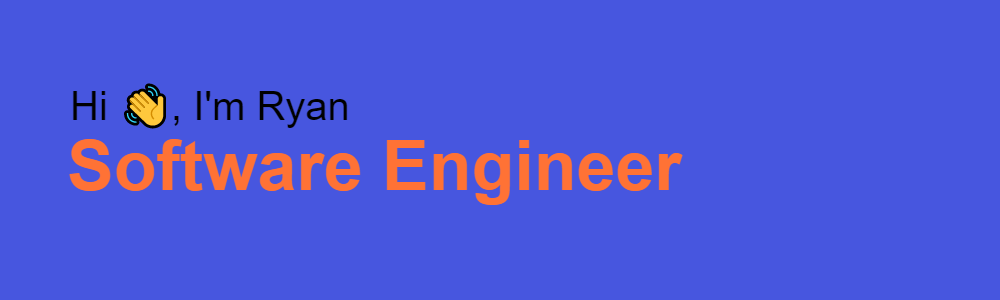
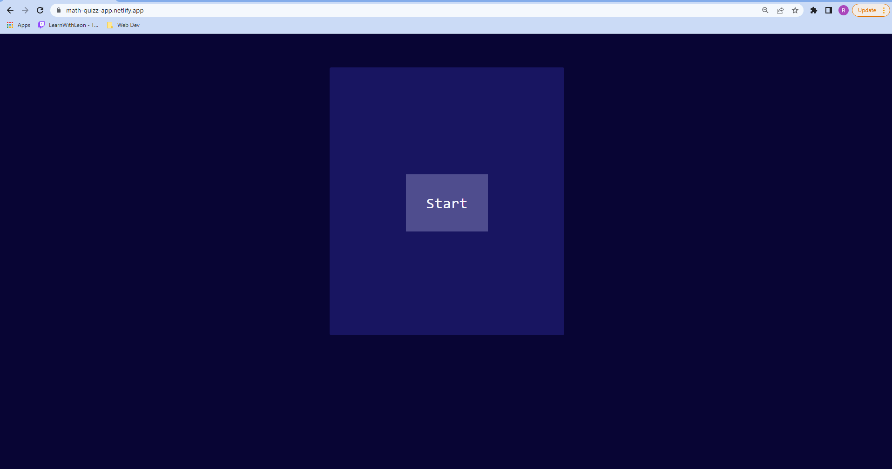
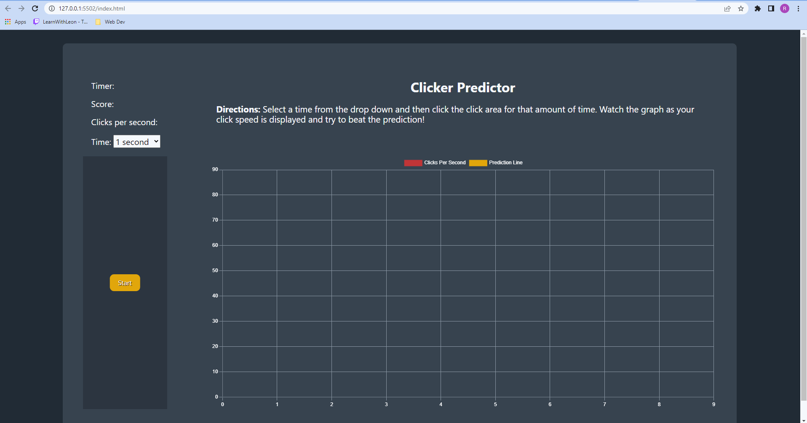

  
  
  
  
  

Previously a mathematics teacher, I am motivated by the power of technology as a tool for positive change. I am looking to take my knowledge and expertise to make an impact on a company with global reach.

See [my website](https://www.ryangibbons.dev/) for more information!

<h1 align="center">Projects</h1>
<table bordercolor="#66b2b2">
  
  <tr>
    <td width="50%" valign="top">
      <h3 align="center">Custom Creations</h3>
         
        
         
        

          
    
  
      

        
<strong>HTML, LESS, CSS & JavaScript</strong> - Static website designed and hand-coded for a small business who sells custom cups, wreaths, pens and more, complete with a built in dark mode.

    </td>
    <td width="50%" valign="top">
      <h3 align="center">Math Quiz</h3>
         
      
         
        

          
  
  
      

        
<strong>Node.js, Express, React, TailwindCSS</strong> - A full stack web application that serves a randomized math question from an API I built with Node.js and Express. The front end is made using React and TailwindCSS.

    </td>
  </tr>
  
  <tr>
    <td width="50%" valign="top">
      <h3 align="center">Clicker Predictor</h3>
       
        
       
        

  
  
      

        
<strong>HTML, CSS, JavaScript, Chart.js & Regression.js</strong> - A web app that allows the user to test their click speed and updates a graph in the DOM with a prediction using linear regression from their previous rounds.

    </td>
    <td width="50%" valign="top">
      <h3 align="center">Coming Soon</h3>
         
        
         
        

          
  
  
      

        
<strong>Technologies Used</strong> - Desctiption about project here.

    </td>
  </tr>
</table>

<h1 align="center">Technologies</h1>

    
    
    
    
    
    
    
    
    
    
  
  
  

---

<h1 align="center">Connect</h1>

  
  
  
  

<h1 align="center">GitHub Stats</h1>

 
